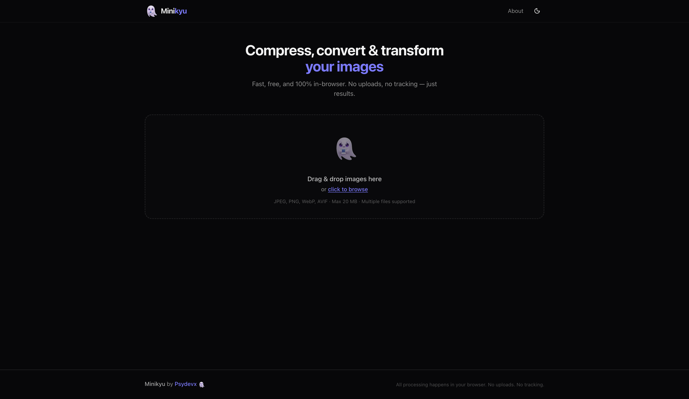

<p align="center">
  
</p>

<h1 align="center">Minikyu</h1>

<p align="center">
  A tiny ghost that shrinks your images — fast, free, and private.
</p>

<p align="center">
  <a href="https://minikyu.vercel.app"></a>
  
  
</p>

---



## ✨ Features

- **Drag & drop** upload — or click to browse
- **Single mode** — before/after clip-path slider comparison
- **Batch mode** — auto-detected when you upload multiple files
- **Compress** with adjustable quality control (0–100)
- **Convert** between JPEG, PNG, WebP, and AVIF
- **Resize** by width, height, or percentage scale
- **Lock aspect ratio** toggle
- **File size comparison** — original vs compressed, with savings %
- **Download** individually or all at once as ZIP
- **Dark mode** — with smooth transitions
- **Mobile responsive**
- **20 MB max** per file
- **100% client-side** — nothing leaves your browser

## 🔒 Privacy First

Your images never leave your device. There are no server uploads, no tracking, no analytics. Everything runs in your browser using the Canvas API and Web Workers. Close the tab and it's gone.

## 🛠 Tech Stack

| Layer       | Technology                                                                            |
| ----------- | ------------------------------------------------------------------------------------- |
| Framework   | [Next.js 16](https://nextjs.org) (App Router)                                         |
| Language    | TypeScript                                                                            |
| Styling     | Tailwind CSS                                                                          |
| Components  | shadcn/ui                                                                             |
| Compression | [browser-image-compression](https://github.com/nicolog-dev/browser-image-compression) |
| ZIP         | [JSZip](https://stuk.github.io/jszip/)                                                |
| Downloads   | [FileSaver.js](https://github.com/nicolog-dev/file-saver)                             |
| Transforms  | Canvas API (built-in)                                                                 |

## 🚀 Getting Started

```bash
# Clone the repo
git clone https://github.com/psydevx/minikyu.git
cd minikyu

# Install dependencies
pnpm install

# Start the dev server
pnpm dev
```

Open [http://localhost:3000](http://localhost:3000) in your browser.

## 📦 How It Works

1. You drop an image (or several) into the upload zone
2. Minikyu reads it locally using `FileReader` and `createImageBitmap`
3. Compression runs through `browser-image-compression`
4. Resizing and format conversion happen on an off-screen `<canvas>`
5. The processed file is handed back to you as a download

No fetch calls. No FormData. No server. Just your browser doing the work.

## 🤝 Contributing

Contributions are welcome! Whether it's a bug fix, new feature, or documentation improvement — PRs are open.

```bash
# Fork the repo, then:
git checkout -b my-feature
# Make your changes
git commit -m "Add my feature"
git push origin my-feature
# Open a PR
```

If you're new to open source, this is a great project to start with. The codebase is small and well-structured.

## 📄 License

MIT — do whatever you want with it.

---

<p align="center">
  Made with 👻 by <a href="https://psydevx.app">Psydevx</a>
</p>
